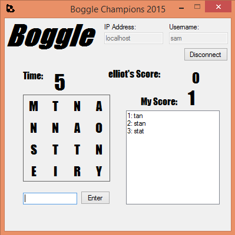

Boogle
======

"In the world of Boogle, there can only be one Boogle Champion. Bring it on." -Hans Bredenberg

A "Boogle" game, with online multiplayer, by [Elliot Hatch](https://github.com/elliothatch) and [Samuel Davidson](https://github.com/samdamana).  

Boogle games are run on port 2000.  

The Boogle server also runs a web server that shows player stats and game history. The web server runs on port 2500, the home screen is at the url `/players`.  

Networking is implemented with the underlying "StringSocket" (PS7.dll), which was also built by us.

BoogleServer
------------
Run with `BoggleServer.exe gameTime dictionaryPath [startingBoard]`, where `gameTime`
is the number of seconds games should last, `dictionaryPath` is line-terminated list of words that should
be allowed in the game, and `startingBoard` is an optional argument defining the game board
that all games played on this server should use. For example "abcdefghijkl" would define a board with
"a b c d" on the first row, "e f g h" on the second row, etc. The server will automatically change "q" to "qu".

BoogleClient
------------
Run BoggleClient.exe, enter a username, and connect to the server. You will be placed in a game as soon as another
player connects to the server.
